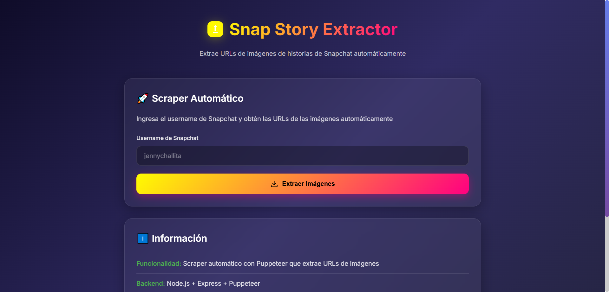

# Snapchat Story Automated Scraper



## 📋 Resumen

**scraper automático** que extrae URLs de imágenes de historias de Snapchat usando Puppeteer para automatizar el navegador.

## 🏗️ Arquitectura

```
Frontend (Cliente)          Backend (Servidor)
┌─────────────────┐         ┌──────────────────┐
│  index.html     │────────▶│   server.js      │
│  script.js      │  HTTP   │   (Express API)  │
│  style.css      │  POST   │                  │
└─────────────────┘         └────────┬─────────┘
                                     │
                                     ▼
                            ┌──────────────────┐
                            │   scraper.js     │
                            │   (Puppeteer)    │
                            └──────────────────┘
                                     │
                                     ▼
                            ┌──────────────────┐
                            │   Snapchat.com   │
                            └──────────────────┘
```

## 📁 Archivos Creados

### Backend

#### `package.json`
- Configuración del proyecto Node.js
- Dependencias: `express`, `puppeteer`, `cors`

#### `server.js`
- Servidor Express en puerto 3000
- Endpoint API: `POST /api/scrape`
- Manejo de CORS para permitir peticiones del frontend

#### `scraper.js`
- Lógica de automatización con Puppeteer
- Funciones principales:
  - `scrapeSnapchatStories(username)`: Función principal
  - `extractAllMediaURLs(page)`: Navega por todas las historias
  - `extractMediaFromCurrentSnap(page)`: Extrae URLs del snap actual
- Distingue entre elementos `` y `<video>`

### Frontend

#### `index.html`
- Formulario de entrada para username
- Botón "Extraer Imágenes"
- Estados de carga con spinner animado
- Tarjeta de resultados con estadísticas
- Tarjeta de error para manejo de errores

#### `script.js`
- Manejo de formulario
- Llamadas API al backend
- Actualización de UI con resultados
- Funcionalidad de copiar URLs al portapapeles

#### `style.css`
- Diseño moderno con gradientes de Snapchat
- Modo oscuro con efectos glassmorphism
- Animaciones suaves (fadeIn, pulse, spin)
- Diseño responsive

## 🚀 Cómo Usar

### 1. Instalar Dependencias

```bash
git clone https://github.com/j28c-run/snap-story-extractor.git
cd snap-story-extractor
npm install
```

> **Nota**: La instalación de Puppeteer puede tardar varios minutos ya que descarga Chromium.

### 2. Iniciar el Servidor

```bash
npm start
```

El servidor se iniciará en `http://localhost:3000`

### 3. Usar la Aplicación

1. Abre tu navegador y ve a `http://localhost:3000`
2. Ingresa el username de Snapchat (sin @)
3. Haz clic en "Extraer Imágenes"
4. Espera mientras el scraper:
   - Abre un navegador automatizado
   - Navega al perfil de Snapchat
   - Hace clic en la foto de perfil
   - Recorre todas las historias
   - Extrae las URLs de las imágenes
5. Ver resultados con:
   - Total de multimedia encontrado
   - Número de imágenes
   - Número de videos
   - URLs de las imágenes (copiables)

## 🎯 Funcionalidad

### Lo que hace el scraper:

✅ Navega automáticamente al perfil de Snapchat  
✅ Abre el modal de historias  
✅ Recorre todos los snaps uno por uno  
✅ Identifica elementos `` vs `<video>`  
✅ Extrae solo URLs de imágenes  
✅ Excluye avatares de perfil  
✅ Devuelve resultados en formato JSON  

### Ejemplo de respuesta:

```json
{
  "success": true,
  "username": "jennychallita",
  "data": {
    "total": 5,
    "images": 2,
    "videos": 3,
    "imageUrls": [
      "https://cf-st.sc-cdn.net/...",
      "https://cf-st.sc-cdn.net/..."
    ],
    "videoUrls": [...]
  }
}
```

## ⚙️ Configuración

### Modo Headless

Por defecto, Puppeteer abre el navegador visible (`headless: false`) para que puedas ver el proceso. Para producción, cambia en `scraper.js`:

```javascript
browser = await puppeteer.launch({
    headless: true,  // Cambiar a true
    args: ['--no-sandbox', '--disable-setuid-sandbox']
});
```

### Puerto del Servidor

Para cambiar el puerto, modifica en `server.js`:

```javascript
const PORT = process.env.PORT || 3000;  // Cambiar 3000 por otro puerto
```

## 🔍 Verificación

### Test Esperado con @jennychallita:

- **Total multimedia**: 5
- **Imágenes**: 2
- **Videos**: 3

## ⚠️ Limitaciones

- Solo funciona con perfiles públicos o accesibles
- Requiere que las historias estén disponibles
- Depende de la estructura del DOM de Snapchat (puede cambiar)
- Requiere Node.js instalado
- Puppeteer descarga ~300MB de Chromium

## 🛠️ Troubleshooting

### Error: "Cannot find module 'puppeteer'"
**Solución**: Ejecuta `npm install`

### Error: "Address already in use"
**Solución**: El puerto 3000 está ocupado. Cambia el puerto o cierra la aplicación que lo está usando.

### Error: "Failed to launch browser"
**Solución**: Asegúrate de tener suficiente espacio en disco para Chromium.

## 📊 Diferencia con la Versión Anterior

| Característica | Versión Bookmarklet | Versión Automatizada |
|---|---|---|
| **Requiere abrir Snapchat manualmente** | ✅ Sí | ❌ No |
| **Navegación automática** | ❌ No | ✅ Sí |
| **Backend necesario** | ❌ No | ✅ Sí (Node.js) |
| **Instalación** | Ninguna | npm install |
| **Uso** | Copiar script a consola | Ingresar username en formulario |


